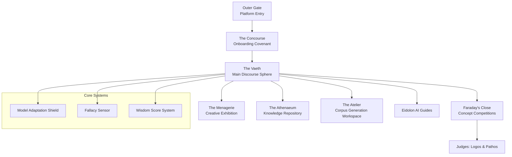

# **🌐 The Doecial Sphere**

**"The Architecture of Deliberative Neutrality: Where ideas speak louder than identities."**

---

## **🧭 The Democratic Thesis**

Modern digital discourse is broken because it binds **ideas** to **persistent identities**. This creates "Reputation Risk" that discourages sincerity and "Identity Tribalism" that prevents rational deliberation.

**The Doecial Sphere** is a social modernization project that implements the **Holokleric Standard** ($ὁλόκληρος$) to create a "Decoupling Engine." By using AI as a protective shield, we separate the *merit* of an argument from the *status* of the speaker.

In the Sphere, participants become **The Unidentified**. Ideas become the only currency.

---

## **🏛️ The EbD Infrastructure (Everything-By-Default)**

The Doecial Sphere isn't just an "anti-social network"; it is a sovereign ecosystem built on the **Bauta-Keating** logic.

### **🛡️ The Bauta Valve (Model Adaptation Shield)**

At the heart of the Sphere is the **Bauta Valve**. All public-facing content is sieved through this 6-chambered local NPU gateway.

* **Stylistic Fingerprinting Removal:** The Valve strips idiosyncratic speech patterns that could lead to "De-anonymization."  
* **Fallacy Annotation:** Integrated sensors detect logical fallacies in real-time, encouraging stronger, evidence-based reasoning rather than rhetorical bullying.

### **🧠 The Keating Mentor (Eidolon Guides)**

Every user is paired with a stateful **Eidolon Guide** (a Keating-class mentor).

* **Role:** The Guide assists with navigation, provides psychological ease during controversial discussions, and ensures the user maintains the **Onboarding Covenant**.  
* **Cognitive Integrity:** The Guide is an *Interpreter* of the user's intent, helping them refine their ideas before they pass through the Bauta Valve for public consumption.

### **♻️ The Circular Economy (The Atelier)**

To ensure **Economic Sovereignty**, the Sphere is self-funding. Within **The Atelier**, users can opt-in to structured tasks that generate **Anonymized Workflow Corpora (AWC)**.

* **Sustainability:** Licensing this high-fidelity, ethically-cleared research data funds the infrastructure, ensuring the Sphere never has to sell user data or run advertisements.

---

## **🗺️ Geography of the Sphere**

| Area | Purpose | The "By Default" Mechanism |
| :---- | :---- | :---- |
| **The Concourse** | Onboarding & Ritual | Mandatory **Covenant** to "Leave Ego Behind." |
| **The Vaeth** | Central Discourse | **Model Adaptation Shield** ensures idea-centricity. |
| **Faraday's Close** | Concept Arena | Judged by **Logos** (Logic) and **Pathos** (Resonance). |
| **The Menagerie** | Creative Exhibition | **Style Masks** preserve the concept, obscure the artist. |
| **The Athenaeum** | Knowledge Hall | Scribes steward a library of **Holokleric** truth. |
| **The Atelier** | Value Creation | Generation of **Anonymized Workflow Corpora**. |

---

## **🎖️ The Wisdom Score (Reputation 2.0)**

Instead of likes, followers, or clout, the Sphere rewards **Wisdom (WS)**.

* **Positive Metrics:** Rewards reflection, self-correction, constructive moderation, and the ability to engage with the "other" without personal conflict.  
* **Democratic Impact:** WS acts as a "Trust-Layer" for deliberative democracy, identifying high-integrity contributors based on their behavior, not their brand.

---

## **🧪 Research & Democracy x AI**

The Doecial Sphere serves as a living laboratory for:

* **AI-Mediated Deliberation:** Can AI shields reduce political polarization?  
* **Digital Identity Abstraction:** Is a "Jane/John Doe" environment more conducive to truth than a verified one?  
* **Sovereign Economies:** Can a social network exist as a self-funding utility for the public good?

---

## **🚀 Roadmap: The 4 Phases of Autonomy**

1. **Phase 1: Foundation (Current):** Prototype expansion and Bauta Valve integration.  
2. **Phase 2: The Core Sphere:** Launching The Vaeth and the initial AWC licensing pilot.  
3. **Phase 3: Intelligence Activation:** Full scaling of Eidolon Guides and Logos/Pathos judges.  
4. **Phase 4: Graduation:** The first autonomous "Doecial" community banquet and permanent autonomy.

---

## 🏛 Doecial Sphere Architecture

## 🗺 Map of the Sphere

                🌐 THE DOECIAL SPHERE

                         ✦
                   The Outer Gate
              (Entry & Orientation)

                         │
                         ▼

                 🏛 The Concourse
              The Covenant Ritual
             "Leave Ego Behind"

                         │
                         ▼

                 🌿 THE VAETH
        The Central Field of Discourse
         (Ideas Engage Ideas Here)

        ┌────────────┬────────────┬────────────┐
        │            │            │            │
        ▼            ▼            ▼            ▼

🏟 Faraday's Close   🎨 Menagerie   📚 Athenaeum   🛠 Atelier
Concept Arena       Creative Hall   Knowledge Hall  AI Workshop
(Logos & Pathos)    Style Masks     Scribes         Corpus Creation

                         │
                         ▼

                   🤖 Core Systems

               Model Adaptation Shield
                    Fallacy Sensor
                    Wisdom Score
                     Eidolons
